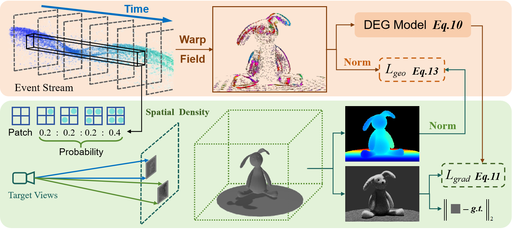

# [PAEv3D](https://arxiv.org/abs/2401.17121) Physical Priors Augmented Event-Based 3D Reconstruction
Jiaxu Wang, Junhao He, Ziyi Zhang, Renjing Xu

<p align="center">
<br>
Fig  1. The overview of PAEv3D.
</p>

The learning-based optical flow estimation method has been released, and the optimization-based method is coming soon.

# Dataset

A large Event-based 3D dataset captured by a real event camera and implementation of Physical Priors Augmented Event-based 3D reconstruction

Download the datasets from [here](https://pan.baidu.com/s/1EuR-l_b_g-j_Du6dOxtZEg?pwd=3ilt ), code:3ilt

Unzip the downloaded datasets into data/ sub-folder in the code directory.

You can construct your own datasets by the following steps:

1. Render the scenario in Blender:
    - Put the object in the origin and let the camera trace bounded by a unit sphere.
    - The groundtruth pose, depth, and optical flow are generated by VisionBlender. 
2. Record the event stream using your event cameras.
3. Align the groundtruth poses, depth, optical flows, and grayscale images with event streams.
4. Dataset formats:
    - H5_Files: The aligned event streams stored in H5 files
    - Render_info: Grayscale images and .npz files which contain poses, depth, and optical flows.
    - Intrinsics: Camera intrinsics
Please contact us if you need to adapt your own event datasets.

# Create environment
```
conda env create --file environment.yml
conda activate paev3d
```

# Training and Testing
```
python <path-to-your-code>/ddp_train_nerf.py --config <path-to-your-code>/configs/*.txt
python <path-to-your-code>/ddp_test_nerf.py --config <path-to-your-code>/configs/*.txt
```

# Citation

please cite our work if you use this dataset.

```
@misc{wang2024physical,
      title={Physical Priors Augmented Event-Based 3D Reconstruction}, 
      author={Jiaxu Wang and Junhao He and Ziyi Zhang and Renjing Xu},
      year={2024},
      eprint={2401.17121},
      archivePrefix={arXiv},
      primaryClass={cs.RO}
}
```
# Reference

EventNeRF: [https://github.com/r00tman/EventNeRF?tab=readme-ov-file](https://github.com/r00tman/EventNeRF?tab=readme-ov-file).
NeRF-OSR: [https://github.com/r00tman/NeRF-OSR](https://github.com/r00tman/NeRF-OSR).
NeRF++: [https://github.com/Kai-46/nerfplusplus](https://github.com/Kai-46/nerfplusplus)

